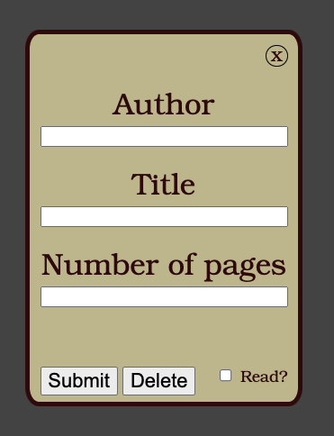

# Library Application
## Creator
  -  Blain Crawford

Created as a way to store and keep track of a list of books, information about them, and whether or not they have been read by the user.

## Technologies Used
  -  JavaScript
  -  CSS
  -  html
##  Running the Application
  -  Clone Repository
  -  Use LiveServer extensnion in VScode to run on localhost
  -  Click on plus button to add book

 <video src="./images/add-button.mov" style=" width: 400px; border-radius: 10%;" autoplay loop></video>
  -  This brings up the book form
  
  -  To add a book, fill in ALL details of the form and mark whether the book has been read or not, then click submit
   <video src="./images/add-book.mov" style=" width: 500px; border-radius: 10%;" autoplay loop></video>
   -  To toggle the status of a book between "read" and "still need to read" click the button in the book's individual tab
    <video src="./images/read-or-not.mov" style=" width: 500px; border-radius: 10%;" autoplay loop></video>
    - There are two ways to remove a book
      -  Simply click the remove button on the tab
       <video src="./images/remove.mov" style=" width: 300px; border-radius: 10%;" autoplay loop></video>
      -  Or search the book details in the book form and click delete instead of submit
       <video src="./images/delete.mov" style=" width: 300px; border-radius: 10%;" autoplay loop></video>
## Make sure to read as much as possible!